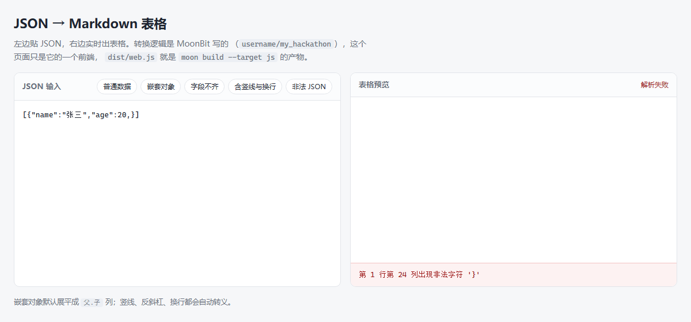

# JSON → Markdown 表格

把 JSON 对象数组转换成 Markdown 表格的 MoonBit 库，附带一个命令行工具。
JSON 解析用的是官方库 `moonbitlang/core/json`，没有手写解析器。

## 特性

- **不丢列**：表头取所有对象键的并集，某一行缺少的键留空单元格，
  不会因为第一行字段少就把后面的列丢掉
- **嵌套自动展开**：`{"addr":{"city":"北京"}}` 变成 `addr.city` 一列，
  而不是把一大坨 JSON 塞进单元格
- **保持原顺序**：表头按键在 JSON 里出现的先后排列，跟原始数据一致；
  需要跨数据源稳定输出时，可以用 `sort_columns` 选项改回字典序
- **自动转义**：反斜杠转义成 `\\`、竖线转义成 `\|`、换行转成 `<br>`，
  值里带这些字符也撑不破表格
- **对齐可选**：整张表可以左对齐、居中或右对齐
- **中文错误**：解析失败时说明原因，并给出出错的行列位置
- **三种输入**：命令行参数、文件（自动剥 UTF-8 BOM）、标准输入管道
- **退出码**：出错时退出码为 1，脚本能直接判断成功与否
- **网页版**：双击 `web/index.html` 就有一个实时转换的界面。页面上的转换逻辑
  不是用 JavaScript 重写的，而是同一份 MoonBit 代码编译成 JS 跑在浏览器里

## 命令行用法

```bash
# 直接写在命令行上
moon run cmd/main '[{"name":"张三","age":20,"city":"北京"}]'

# 从文件读（自动剥掉 UTF-8 BOM）
moon run cmd/main --file data.json

# 从管道读
cat data.json | moon run cmd/main --stdin

# 什么都不给：打印帮助和一个内置示例
moon run cmd/main
```

输出：

```text
| name | age | city |
| --- | --- | --- |
| 张三 | 20 | 北京 |
```

参数一览：

| 参数 | 说明 |
| --- | --- |
| `<JSON>` | 直接写在命令行上的 JSON 文本 |
| `-f, --file <路径>` | 从文件读 JSON，自动剥掉开头的 UTF-8 BOM |
| `--stdin` | 从标准输入读 JSON，配合管道用 |
| `--align <方式>` | 对齐方式：`left`（默认）/ `center` / `right` |
| `--no-flatten` | 不展平嵌套对象，压成一行 JSON 放进单元格 |
| `--sort` | 表头改按字典序排列 |
| `-h, --help` | 显示帮助 |

位置参数、`--file`、`--stdin` 三者互斥，同时给两个会报错。

```bash
moon run cmd/main --align center --file data.json
moon run cmd/main --no-flatten --sort '[{"a":{"b":1}}]'
```

`-h` / `--help` 和 `moon run` 自己的选项重名，要透传给程序得用 `--` 隔开：

```bash
moon run cmd/main -- --help
```

出错时错误信息打到标准输出，退出码为 1，帮助和成功转换的退出码为 0。

## 网页版

在线试用：<https://mik1e80.github.io/json-to-markdown-table/>


`web/index.html` 是一个交互界面：左边贴 JSON，右边实时出表格，写错了直接在
下面显示中文错误（带行列位置）。页面上方有五个一键示例。



**用浏览器打开 `web/index.html` 就能用**——不用装 npm、不用起服务器、不用构建。
转换逻辑不是用 JavaScript 重写的，而是 `web/dist/web.js`：真正的 MoonBit 代码
经 `moon build --target js` 编译出来的，页面调的就是它导出的 `convert()`。

打开方式（随便挑一个）：

| 方式 | 操作 |
| --- | --- |
| 文件管理器 | 在 `web/` 目录里双击 `index.html` |
| 命令行 | `start "" "路径\web\index.html"` |
| 拖拽 | 把 `index.html` 拖进已经开着的浏览器窗口 |

> **注意**：在 VS Code 的文件列表里双击，只会用编辑器打开源码，不会启动浏览器。
> 那种情况在文件上右键选「Reveal in File Explorer」，再在弹出来的窗口里双击。

这几件事让「打开就能用」成立：

| 做法 | 原因 |
| --- | --- |
| `format: "iife"` | ES module 在 `file://` 下会被 CORS 拦掉，classic script 不会 |
| 产物提交进仓库 | 别人 clone 下来直接打开，不必先跑构建 |
| 自己写迷你表格渲染器 | 不引 CDN 上的 marked.js，离线也能用 |

改了 `web/web.mbt` 或库代码之后重新生成产物：

```bash
bash web/build.sh
```

### 分享给别人

想把页面发给别人（微信、邮件都行），打包成**单个 HTML 文件**：

```bash
bash web/pack.sh
# 生成 web/dist/json-to-markdown-table.html，约 270 KB
```

这个文件把样式、页面逻辑、MoonBit 编译产物全部内联在一起，对方收到直接
双击就能用——不用联网、不用装环境、不用起服务器，也不依赖同目录下的其它文件。

单文件版本是生成物，没进版本库。改了源码就重新跑一次 `pack.sh` 再发。

## 库用法

对外只有三个函数和一个选项结构：

| 函数 | 说明 |
| --- | --- |
| `json_to_markdown_table(input)` | 解析 + 转换，一步到位 |
| `json_to_markdown_table_with(input, options)` | 同上，但可以指定选项 |
| `parse_json(input)` | 只做解析，需要自己处理 JSON 时用 |

函数都返回 `Result`：成功是 `Ok`，失败是 `Err(错误信息)`。

选项用 `Options`，默认值由 `Options::default()` 给出：

```mbt check
///|
test {
  let options : Options = { ..Options::default(), sort_columns: true, }
  match
    json_to_markdown_table_with("[{\"name\":\"张三\",\"age\":20}]", options) {
    Ok(md) =>
      assert_true(md == "| age | name |\n| --- | --- |\n| 20 | 张三 |\n")
    Err(_) => fail("示例不该失败")
  }
}
```

```mbt check
///|
test {
  let input = "[{\"name\":\"张三\",\"age\":20}]"
  match json_to_markdown_table(input) {
    Ok(md) =>
      assert_true(md == "| name | age |\n| --- | --- |\n| 张三 | 20 |\n")
    Err(_) => fail("示例不该失败")
  }
}
```

## 转换规则

顶层输入：

| 输入 | 结果 |
| --- | --- |
| 对象数组 `[{...}, {...}]` | 每个对象一行 |
| 单个对象 `{...}` | 一行 |
| 空数组 `[]` | 空字符串 |
| 其他类型 | `Err`，错误信息里说明当前是什么类型 |

对齐方式用 `Alignment`，作用于整张表：

| 取值 | 分隔行 | 效果 |
| --- | --- | --- |
| `Left`（默认） | `---` | 左对齐 |
| `Center` | `:---:` | 居中 |
| `Right` | `---:` | 右对齐 |

单元格取值：

| JSON 值 | 单元格内容 |
| --- | --- |
| `null` | 空 |
| `true` / `false` | `true` / `false` |
| 数字 | 优先用原始写法（超出双精度时），否则用 Double 的文本，`1.50` 会规范化成 `1.5` |
| 字符串 | 原样输出，竖线和换行会被转义 |
| 数组 | 压成一行 JSON |
| 对象 | 默认展平成 `父.子` 形式的列（见下），可用 `flatten_objects: false` 关掉 |

### 嵌套对象怎么展平

`{"name":"张三","addr":{"city":"北京","zip":"100000"}}` 会展开成三列：

| name | addr.city | addr.zip |
| --- | --- | --- |
| 张三 | 北京 | 100000 |

- 递归展开，`{"a":{"b":{"c":1}}}` 得到 `a.b.c` 一列
- 数组不展平，照旧压成一行 JSON
- 空的嵌套对象保留列名，单元格留空
- 万一展平出来的列名和本来就有的键撞了（比如同时存在 `{"a":{"b":1}}` 和 `"a.b":2`），
  **直接写出来的键赢**，且与键的书写顺序无关

## 开发

```bash
moon check   # 编译检查
moon test    # 跑测试
moon fmt     # 格式化
moon info    # 更新 .mbti 接口文件
```

实测结果：

```text
Total tests: 99, passed: 99, failed: 0.
```

99 个用例 = 库的黑盒测试 31 + 库的白盒测试 35 + CLI 白盒测试 20 +
web 导出层白盒测试 11 + README 里这两段可执行示例。
`moon check` 与 `moon test` 都是零警告。

网页那部分的验证方式：用无头 Edge 把渲染后的 DOM 导出来，逐个核对边界用例
（`a\|b` 的还原、带首尾空格的值、空数组、非法 JSON 的行列位置），
比看截图可靠。

依赖都是官方的：

| 包 | 用途 |
| --- | --- |
| `moonbitlang/core/json` | JSON 解析（库本体唯一依赖） |
| `moonbitlang/core/argparse` | 命令行参数解析 |
| `moonbitlang/x/fs` | 读文件 |
| `moonbitlang/x/sys` | 设置退出码 |
| `moonbitlang/async` | 读标准输入 |

网页版没有额外依赖：`web` 包只 import 了库本身，编译到 `js` 后端不需要任何
第三方包，页面也没有引任何 CDN。

测试里的断言用的是内置的 `assert_eq`、`assert_true` 与 `fail`，不需要额外依赖。
`cmd/main` 依赖 `moonbitlang/async`，而它只在 wasm 和 native 后端有实现，
所以命令行工具限定在这两个后端构建；库本身没有这个限制。

## 项目结构

- `json2md.mbt` — 库实现
- `json2md_test.mbt` — 公开 API 的黑盒测试
- `json2md_wbtest.mbt` — 内部函数的白盒测试
- `cmd/main/main.mbt` — 命令行工具
- `cmd/main/main_wbtest.mbt` — 参数解析、选项组装、BOM 剥离的测试
- `web/index.html`、`web/style.css`、`web/app.js` — 网页界面
- `web/web.mbt` — 导出给 JavaScript 的那层，`web/dist/web.js` 是它的编译产物
- `web/build.sh` — 重新生成 `web/dist/web.js`
- `web/pack.sh` — 打包成单个 HTML 文件，用来发给别人
