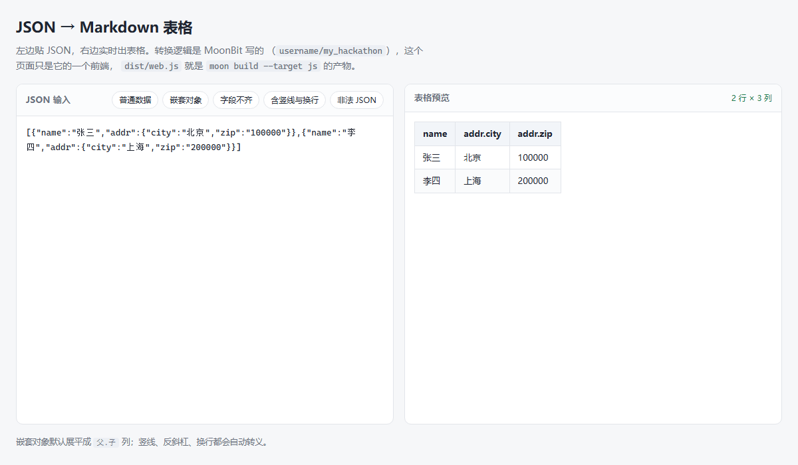

# json-to-markdown-table

用 MoonBit 实现的 JSON 转 Markdown 表格工具。提供**库、命令行、网页**三种用法，
三者跑的是同一份转换代码。

**在线试用：<https://mik1e80.github.io/json-to-markdown-table/>**



---

## 三种用法

| 形态 | 位置 | 怎么用 | 拿到什么 |
| --- | --- | --- | --- |
| **网页** | `web/` | 打开上面的在线链接，或在浏览器里打开 `web/index.html` | 预览 + Markdown 源码，可一键复制或下载成 `.md` |
| **命令行** | `cmd/main/` | `moon run cmd/main --file data.json` | 表格打到标准输出，重定向即可存文件 |
| **库** | `json2md.mbt` | `@json2md.json_to_markdown_table(input)` | 函数返回 `String` |

网页版是纯前端的：MoonBit 经 `moon build --target js` 编译成 JS 在浏览器里跑，
没有后端依赖，双击 `web/index.html` 就能离线使用。

## 能力

转换出来的表格：

- 嵌套对象自动展平成 `addr.city` 这样的列
- 表头取所有对象的键的并集，缺字段的行留空，不会丢列
- 表头按键在 JSON 里出现的顺序排列，可选字典序
- 竖线、反斜杠、换行自动转义，撑不破表格
- 整张表可左对齐 / 居中 / 右对齐

输入和报错：

- 解析失败给出中文错误和行列位置
- 命令行支持位置参数、文件（自动剥 UTF-8 BOM）、标准输入管道三种来源
- 网页版实时转换，写错了直接在预览下方提示，并给出可复制的 Markdown 源码

JSON 解析用的是官方库 `moonbitlang/core/json`，没有手写解析器。

## 文档

详细的用法、API、转换规则和开发说明都在 [`README.mbt.md`](README.mbt.md)。

## 开发

仓库根目录就是 MoonBit 模块根，不用 `cd`：

```bash
moon test            # 跑测试（99 个，零警告）
moon run cmd/main    # 不带参数会打印帮助和示例
bash web/build.sh    # 重新编译网页用的 JS
bash web/pack.sh     # 打包成单个 HTML，方便发给别人
```

网页部分由 GitHub Actions 自动发布，见 [`.github/workflows/pages.yml`](.github/workflows/pages.yml)。
